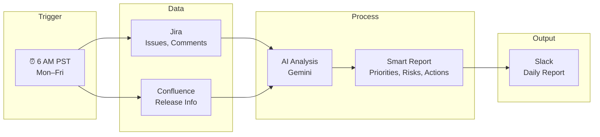
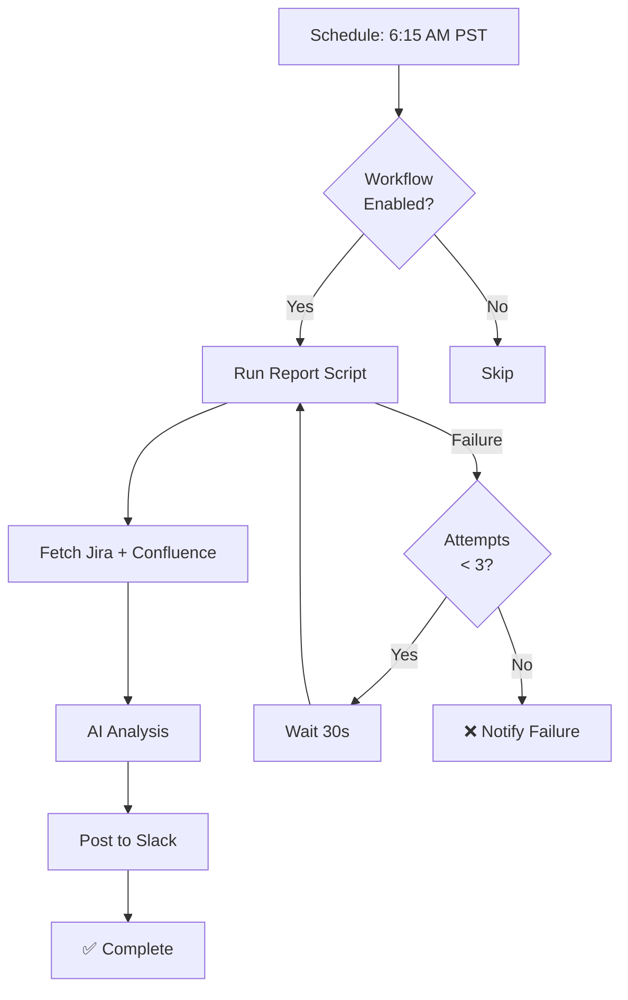

# StandupPulse — Leadership Overview

**AI-Powered Automated Daily Status for AINV, ARPT & AEM**

---

## Executive Summary

**StandupPulse** is an automated workflow that delivers a concise, AI-analyzed status report to Slack every weekday morning. It pulls data from Jira and Confluence, uses AI to prioritize and summarize, and surfaces the most important actions—without manual effort.

**Key benefits:**
- **Zero manual effort** — Runs automatically at 6 AM PST, Mon–Fri
- **AI-powered insights** — Prioritizes work, identifies risks, suggests actions
- **Single source of truth** — Jira + Confluence, analyzed in context
- **Reliable** — Retries on failure; runs in the cloud (no local machine needed)

---

## How It Works (High-Level)

| Step | What Happens |
|------|--------------|
| **1. Trigger** | GitHub Actions runs the workflow at 6:15 AM PST every weekday |
| **2. Gather** | Fetches from Jira (your items, bugs, release blockers, comments) and Confluence (release/schedule pages) |
| **3. Analyze** | AI (Google Gemini) reviews the data and produces priorities, risk level, and actionable next steps |
| **4. Deliver** | Report is posted to a designated Slack channel |

---

## What the Report Includes

| Section | Purpose |
|---------|---------|
| **Executive Summary** | 2–3 sentence overview of the day |
| **Your Items** | Assigned work, with context from comments (e.g., tests passed/failed, reviewer feedback) |
| **Bugs to Watch** | Critical bugs, release blockers, unassigned items |
| **Release Readiness** | Risk level and what’s blocking release |
| **Top 3–5 Actions Today** | Specific, prioritized next steps |

---

## Setup Overview

1. **Repository** — Code lives in a GitHub repo (e.g., `Jeevan-Daily-reports`)
2. **Secrets** — Jira, Slack, and AI API credentials are stored securely in GitHub Secrets
3. **Schedule** — Cron job runs at 6:15 AM PST, Mon–Fri
4. **Retry** — Up to 3 attempts if a run fails

**No local setup required.** The workflow runs entirely in GitHub’s cloud.

---

## Execution Flow

---

## Technology Stack

| Component | Technology |
|-----------|------------|
| **Orchestration** | GitHub Actions |
| **Data Sources** | Jira REST API, Confluence REST API |
| **AI** | Google Gemini (free tier) |
| **Delivery** | Slack API |
| **Language** | Python 3 (stdlib + urllib) |

---

## Links & Resources

| Resource | Link |
|----------|------|
| **GitHub Repo** | [github.com/jsaigali-tech/Jeevan-Daily-reports](https://github.com/jsaigali-tech/Jeevan-Daily-reports) |
| **Workflow Runs** | [Actions tab](https://github.com/jsaigali-tech/Jeevan-Daily-reports/actions) |
| **Setup Guide** | [README](../README.md) |

---

## Summary

StandupPulse automates status gathering and analysis so teams get a consistent, AI-enhanced view of sprint health every morning—without manual updates or meetings.

---

*Document version: 1.0 | Last updated: March 2025*
